# sd_internet_benevolencia
Pesquisa com ciência de dados em sociologia do direito sobre percepção de benevolência da internet pelo direito brasileiro.

#### Relatório da pesquisa (V1):

[Sociologia do Direito - Internet Benevolente?](SociologiaDireito-LucasBorgesVieira-TemaInternet.pdf)

#### Caminho para os scripts e notebooks mais importantes:
[sd_scrap/sd_scrap/spiders](sd_scrap/sd_scrap/spiders)

---

---

---

#### Algumas das visualisações mais chamativas:

---

---

---
###### Benevolência (como a internet e as tecnologias adjacentes são compreendidas pela lei)

---
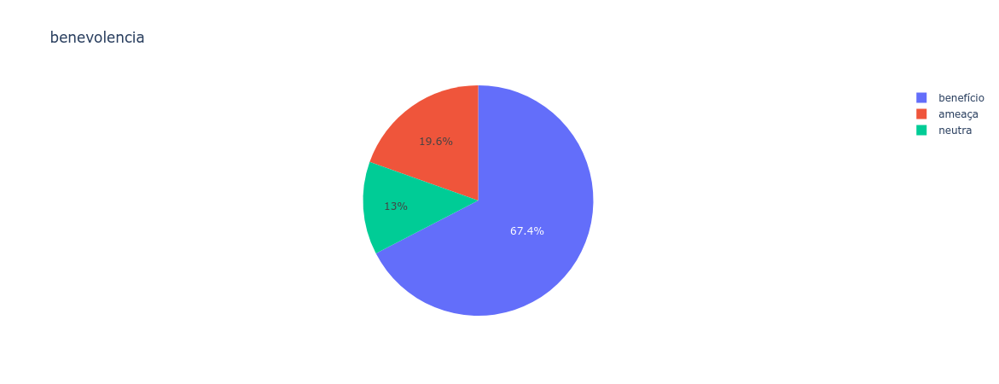
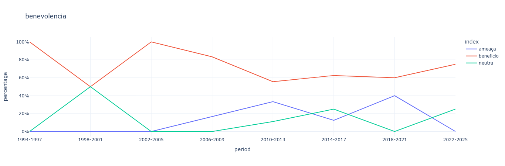
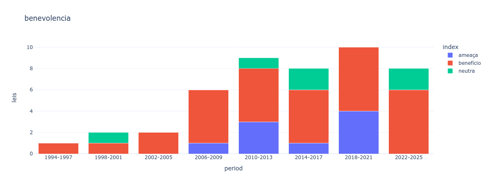
---
###### Dimensão (Ontológicas criam significados, Normativas apenas os utilizam)

---
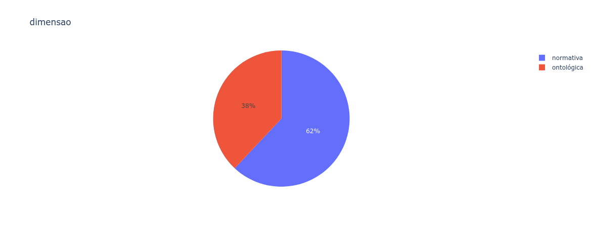
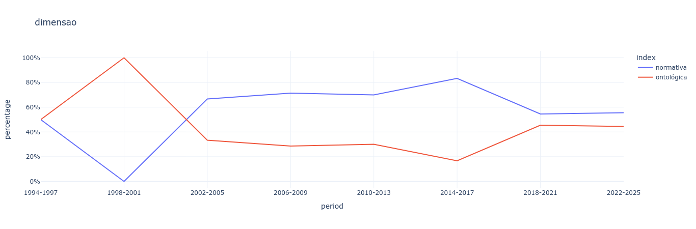
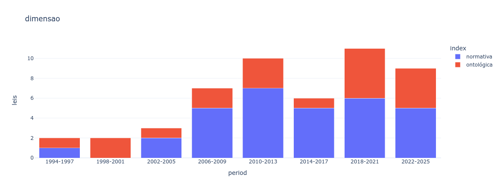
```grey
Benevolência seccionada por dimensão:
```
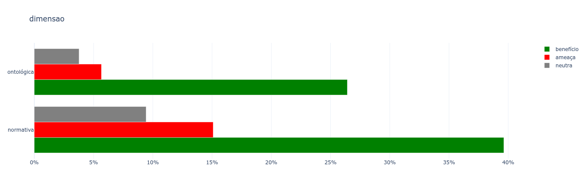
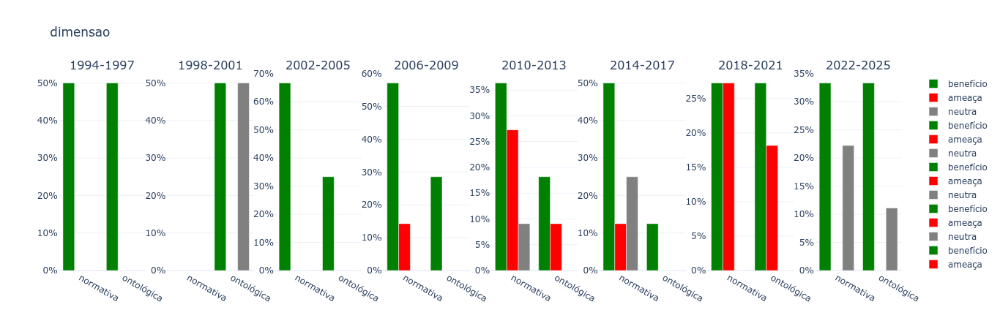
---
###### Imposição ou Reconhecimento (de comportamentos relacionados à internet)

---
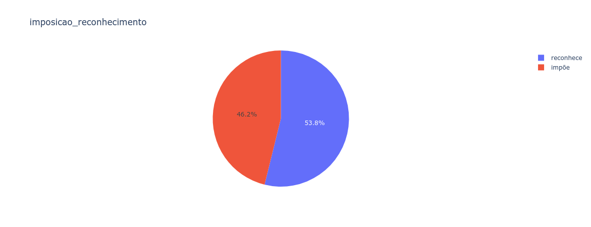
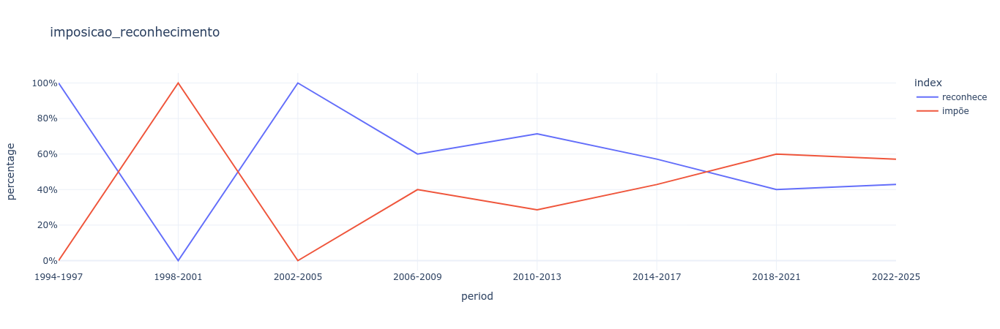
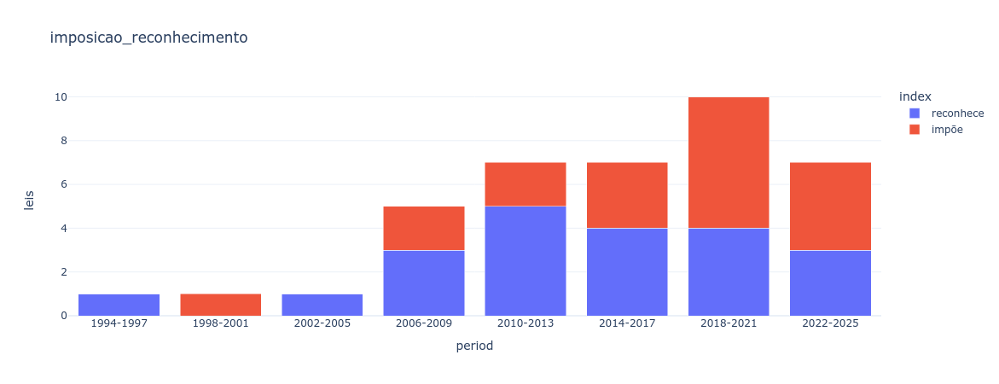
```grey
Benevolência seccionada por imposição ou reconhecimento:
```
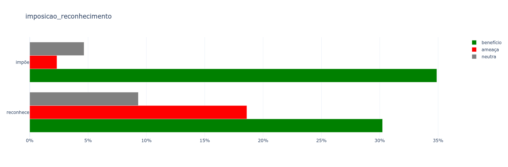
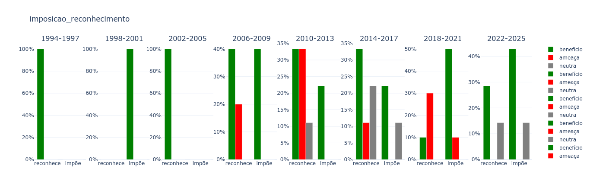